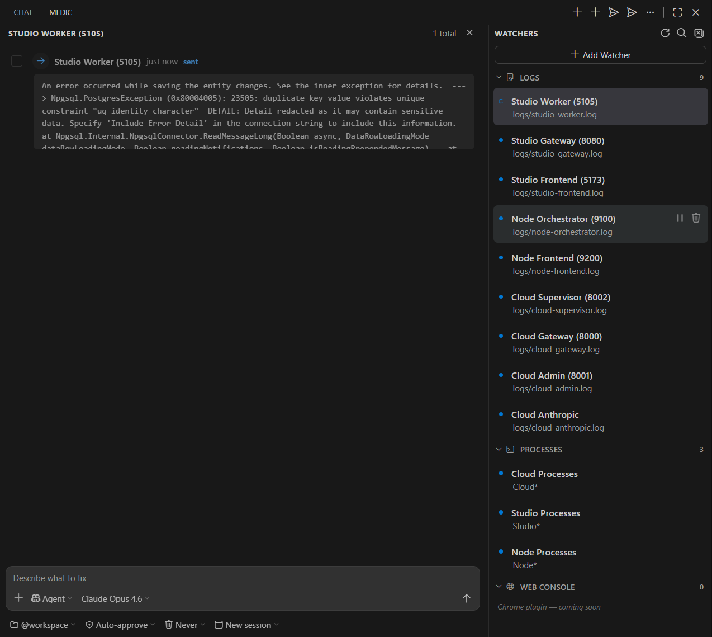
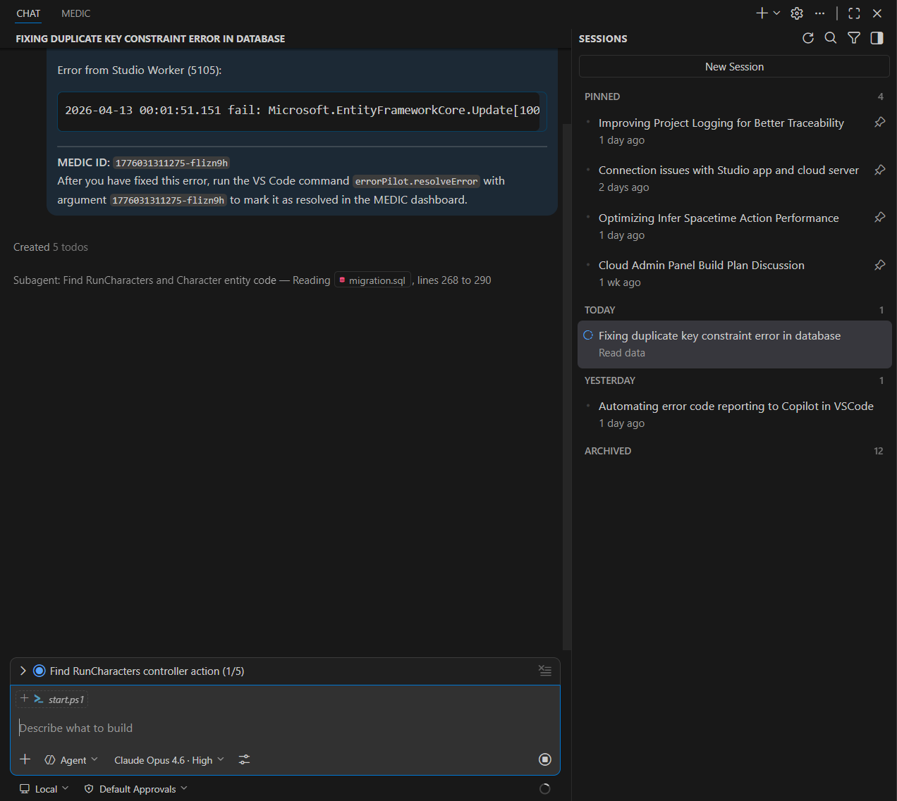

# MEDIC

**Runtime error monitoring for VS Code — automatically dispatches errors to GitHub Copilot for diagnosis and fixing.**

MEDIC watches your running application's log files and terminal output for runtime errors, displays them in a real-time dashboard, and sends them straight to GitHub Copilot Chat with full context — so the AI agent can diagnose and fix issues as they happen.

| Error detected in MEDIC dashboard | Copilot diagnosing and fixing the error |
|---|---|
|  |  |

---

## Why MEDIC?

When you're running a full-stack app, errors can appear anywhere — buried in log files, scrolling past in terminals, or hidden across multiple services. Manually copying errors into Copilot Chat is tedious and slow.

MEDIC automates the entire loop:

1. **Detect** — File and terminal watchers catch errors the moment they appear
2. **Triage** — Errors show up in a live dashboard with duplicate grouping and severity tracking
3. **Dispatch** — One click (or auto-trigger) sends errors to Copilot with full context
4. **Resolve** — Copilot fixes the code; MEDIC marks the error as resolved

---

## Features

### Error Watchers
- **Log file monitoring** — Watch any log file for error patterns (supports `.log`, `.txt`, structured logs)
- **Terminal monitoring** — Capture errors from any VS Code terminal by name pattern
- **Built-in presets** — Ready-made patterns for .NET, Python, Node.js, Rust, Go, and more
- **Custom regex** — Write your own patterns with named capture groups (`message`, `file`, `line`)
- **UTF-16LE & ANSI support** — Handles Windows-style log files and strips color codes automatically

### Live Dashboard
- **Two-column layout** — Error feed on the left, watchers sidebar on the right (responsive single-column on narrow panels)
- **Error cards** — Collapsible cards with source, timestamp, severity icon, and full stack trace
- **Duplicate grouping** — Identical errors are grouped with occurrence counters and smooth re-occurrence animations
- **Status tracking** — Each error flows through `pending → sent → resolved` lifecycle
- **Source filtering** — Click any watcher name to filter errors from that source
- **Watcher status dots** — Green/red/gray indicators show which watchers are active

### Copilot Integration
- **Chat mode selector** — Choose between Agent (autonomous fixes), Ask (Q&A), or Plan (plan before fixing)
- **Model selector** — Pick any available language model from the dropdown
- **Session mode** — Send to a new chat session or continue in the active one
- **Agent participant** — Route to `@workspace`, `@terminal`, `@vscode`, or default Copilot
- **Approval mode** — Auto-approve agent actions or require confirmation
- **Compose box** — Add a guiding note to customize how Copilot should approach the fix
- **Auto-trigger** — Optionally send errors to Copilot automatically on detection (configurable debounce)

### Prompt Engineering
- **Customizable templates** — Full control over the prompt sent to Copilot via template variables
- **Resolve instructions** — Prompts include the `errorPilot.resolveError` command so Copilot can mark errors as fixed
- **Multi-error batching** — Select multiple errors and send them in a single prompt
- **User notes** — Append guidance ("focus on the database layer", "don't modify tests") to any dispatch

---

## Quick Start

1. **Install** the extension from the VS Code Marketplace (or build from source)
2. Open the **MEDIC** panel from the Activity Bar (eye + cross icon)
3. MEDIC auto-creates watchers for common log paths — or click **+** to add your own:
   - **Log file**: Point to your app's log file (relative or absolute path, supports glob patterns)
   - **Terminal**: Match terminals by name (e.g., `*` for all, `dotnet*` for .NET terminals)
4. Errors appear in the dashboard as they're detected
5. Click the **send** button on any error, or use the compose box to add context before sending
6. Copilot opens with the error and full context, ready to fix

> **Tip:** For the best experience, right-click the MEDIC icon in the Activity Bar and select **"Move to Secondary Side Bar"** to place it alongside Copilot Chat on the right.

---

## Configuration

All settings are under `errorPilot.*` in VS Code Settings, or configurable directly from the MEDIC dashboard pickers.

| Setting | Default | Description |
|---------|---------|-------------|
| `errorPilot.agent` | `@workspace` | Chat participant to prefix prompts with |
| `errorPilot.autoTrigger` | `false` | Auto-send errors to Copilot on detection |
| `errorPilot.debounceMs` | `3000` | Debounce delay before auto-sending (ms) |
| `errorPilot.promptTemplate` | *(built-in)* | Prompt template with `{source}`, `{error}`, `{file}`, `{line}`, `{raw}`, `{stackTrace}` variables |
| `errorPilot.maxQueueSize` | `50` | Maximum errors to keep in queue |
| `errorPilot.approvalMode` | `confirm` | `confirm` or `auto` — whether agent actions need approval |
| `errorPilot.autoDeleteSession` | `never` | `never`, `done`, or `5min` — auto-delete resolved sessions |
| `errorPilot.chatMode` | `agent` | Default chat mode: `agent`, `ask`, or `plan` |
| `errorPilot.chatModel` | *(auto)* | Preferred language model ID |
| `errorPilot.sessionMode` | `new` | `new` (fresh session per send) or `active` (reuse current) |

### Custom Error Patterns

Error patterns use JavaScript regex with optional **named capture groups**:

```regex
(?:ERROR|FATAL):\s*(?<message>.+)
at .+ in (?<file>.+):line (?<line>\d+)
```

Supported named groups: `message`, `file`, `line`.

---

## Commands

All commands are available from the Command Palette (`Ctrl+Shift+P`) under the **MEDIC** category:

| Command | Description |
|---------|-------------|
| `MEDIC: Add Watcher` | Add a new file or terminal watcher |
| `MEDIC: Remove Watcher` | Remove a watcher |
| `MEDIC: Send to Copilot` | Send selected error to Copilot Chat |
| `MEDIC: Send All Pending` | Send all pending errors in one prompt |
| `MEDIC: Dismiss Error` | Remove an error from the queue |
| `MEDIC: Clear All Errors` | Clear the entire error queue |
| `MEDIC: Mark Error as Fixed` | Manually mark an error as resolved |
| `MEDIC: Toggle Auto-Trigger` | Enable/disable automatic Copilot dispatch |
| `MEDIC: Scan Workspace` | Auto-detect and add watchers for common log paths |
| `MEDIC: Settings` | Open MEDIC settings |

---

## Requirements

- **VS Code** 1.93.0 or later
- **GitHub Copilot** extension (for chat integration)

---

## Development

```bash
git clone https://github.com/bitinglip/vscode-medic.git
cd vscode-medic
npm install
npm run build
```

Press **F5** to launch the Extension Development Host.

### Building a VSIX

```bash
npm install -g @vscode/vsce
vsce package --no-dependencies
```

### Project Structure

```
src/
├── extension.ts              # Extension entry point, command registration
├── ErrorQueue.ts             # In-memory error store with lifecycle tracking
├── WatcherManager.ts         # File and terminal watcher management
├── CopilotBridge.ts          # Prompt building and Copilot Chat integration
├── ErrorPilotViewProvider.ts # Webview dashboard provider
└── types.ts                  # Shared types and default watcher presets
media/
├── main.js                   # Webview client-side logic
└── main.css                  # Webview styling
resources/
├── icon.svg                  # Activity bar icon (monochrome)
└── icon.png                  # Marketplace icon (256×256)
```

---

## Contributing

Contributions are welcome. Please open an issue first to discuss what you'd like to change.

1. Fork the repository
2. Create a feature branch (`git checkout -b feature/my-feature`)
3. Commit your changes (`git commit -am 'Add my feature'`)
4. Push to the branch (`git push origin feature/my-feature`)
5. Open a Pull Request

---

## License

MIT — see [LICENSE](LICENSE).
