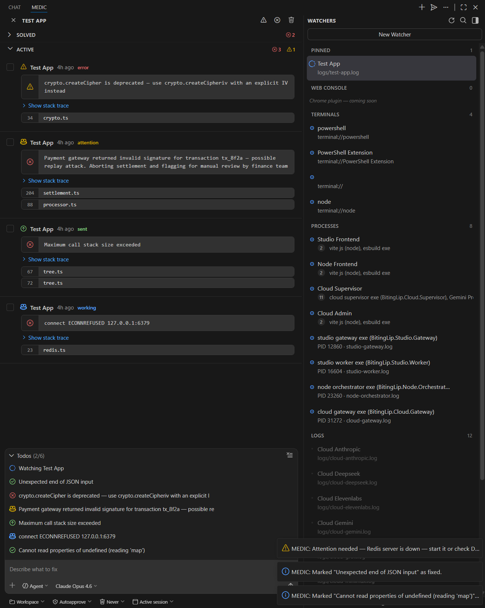

# MEDIC

*Runtime error & warning monitoring with automatic dispatching to GitHub Copilot for diagnosis and fixing.*

*Feedback and issues welcome at https://github.com/BitingLip/vscode-medic/issues*

## Automated fixing of Errors & Warnings with Copilot agents

When you're running a full-stack app, errors can appear anywhere — buried in log files, scrolling past in terminals, or hidden across multiple services. Manually copying errors into Copilot Chat is tedious and slow.

MEDIC automates the entire loop with **continuously running watchers** that spin up **agent sessions** when errors or warnings appear.

### `Watchers` keep an eye on your workspace
- **Automated discovery** of processes, terminals and logs
- Full coverage
   - **Process** PID's logs
   - **Terminal** outputs
   - **Web Console** logs
- Full automation
   1. **Detect** — File and terminal watchers catch errors the moment they appear
   2. **Triage** — Errors show up in a live dashboard with duplicate grouping and severity tracking
   3. **Dispatch** — One click (or auto-trigger) sends errors to Copilot with full context
   4. **Resolve** — Copilot fixes the code; MEDIC marks the error as resolved

### `Agents` fix the errors and investigate the warnings
- Automated workflow
   - Starting agent sessions for jobs
   - Prompting the agent with full error context and stack traces
- Agent interacts with MEDIC extension
   - Gives status updates `working`, `attention`, `resolved`, `error`




---

## Features

### Error Watchers
- **Log file monitoring** — Watch any log file for error patterns (supports `.log`, `.txt`, structured logs)
- **Terminal monitoring** — Capture errors from any VS Code terminal by name pattern
- **Process discovery** — Automatically finds running OS processes that reference the workspace, extracts log file paths from `Tee-Object`, stdout redirects, and Linux `tee` pipes
- **Parent chain resolution** — Walks up to 5 levels of the process parent chain to find log file targets, with ancestor inheritance for deep process trees
- **Built-in presets** — Ready-made patterns for .NET, Python, Node.js, Rust, Go, and more
- **Custom regex** — Write your own patterns with named capture groups (`message`, `file`, `line`)
- **UTF-16LE & ANSI support** — Handles Windows-style log files and strips color codes automatically

### Live Dashboard
- **Four-section sidebar** — Processes, Terminals, Web Console, and Logs — each with grouped counts
- **Process grouping** — Services sharing a log file are grouped into collapsible clusters (e.g., Cloud Supervisor with 11 proxy service members, frontend groups with vite + esbuild)
- **Smart naming** — Process names derived from executables: `cloud gateway exe (BitingLip.Cloud.Gateway)`, `vite js (node)`, `Gemini Proxy`
- **Stack trace extraction** — Multi-line stack traces are accumulated and parsed; file references (`file:line:col`) are extracted from Node.js, .NET, and Python frames
- **Error cards** — Collapsible cards with source, timestamp, severity icon, file references, and full stack trace
- **Severity vs. status icons** — Code block sidebar always shows error/warning severity; header shows job status (working, resolved, attention, error)
- **Duplicate grouping** — Identical errors are grouped with occurrence counters and smooth re-occurrence animations
- **Status tracking** — Each error flows through `pending → sent → working → resolved/attention/error` lifecycle
- **Source filtering** — Click any watcher or group to filter errors from that source
- **Watcher status dots** — Color-coded indicators show which watchers are active, erroring, or paused

### Copilot Integration
- **Compose box** — Select errors as chips, add guiding notes, and dispatch to Copilot with full context
- **Chat mode selector** — Choose between Agent (autonomous fixes), Ask (Q&A), or Plan (plan before fixing)
- **Model selector** — Pick any available language model from the dropdown (auto-deduplicates, grouped by vendor)
- **Session mode** — Send to a new chat session or continue in the active one
- **Agent participant** — Route to `@workspace`, `@terminal`, `@vscode`, or default Copilot
- **Approval mode** — Auto-approve agent actions or require confirmation
- **Auto-trigger** — Optionally send errors to Copilot automatically on detection (configurable debounce)
- **Status commands** — Copilot can mark errors as working, resolved, needs attention, or agent error via MEDIC commands *(settings use the `medic` prefix)*

### Prompt Engineering
- **Customizable templates** — Full control over the prompt sent to Copilot via template variables
- **Resolve instructions** — Prompts include the `medic.resolveError` command so Copilot can mark errors as fixed
- **Multi-error batching** — Select multiple errors and send them in a single prompt
- **User notes** — Append guidance ("focus on the database layer", "don't modify tests") to any dispatch

---

## Quick Start

1. **Install** the extension from the VS Code Marketplace (or build from source)
2. Open the **MEDIC** panel from the Activity Bar (eye + cross icon)
3. MEDIC automatically discovers:
   - **Running processes** referencing your workspace (with log file resolution)
   - **Open terminals** in VS Code
   - **Log files** matching common patterns in your workspace
4. Processes sharing a log file are grouped into collapsible clusters
5. Errors appear in the dashboard as they're detected
6. Select errors in the compose box, optionally add context, and send to Copilot
7. Copilot fixes the code and marks errors as resolved via MEDIC commands

> **Tip:** For the best experience, right-click the MEDIC icon in the Activity Bar and select **"Move to Secondary Side Bar"** to place it alongside Copilot Chat on the right.

---

## Configuration

All settings are under `medic.*` in VS Code Settings, or configurable directly from the MEDIC dashboard pickers.

| Setting | Default | Description |
|---------|---------|-------------|
| `medic.agent` | `@workspace` | Chat participant to prefix prompts with |
| `medic.autoTrigger` | `false` | Auto-send errors to Copilot on detection |
| `medic.debounceMs` | `3000` | Debounce delay before auto-sending (ms) |
| `medic.promptTemplate` | *(built-in)* | Prompt template with `{source}`, `{error}`, `{file}`, `{line}`, `{raw}`, `{stackTrace}` variables |
| `medic.maxQueueSize` | `50` | Maximum errors to keep in queue |
| `medic.approvalMode` | `confirm` | `confirm` or `auto` — whether agent actions need approval |
| `medic.autoDeleteSession` | `never` | `never`, `done`, or `5min` — auto-delete resolved sessions |
| `medic.chatMode` | `agent` | Default chat mode: `agent`, `ask`, or `plan` |
| `medic.chatModel` | *(auto)* | Preferred language model ID |
| `medic.sessionMode` | `new` | `new` (fresh session per send) or `active` (reuse current) |

### Custom Error Patterns

Error patterns use JavaScript regex with optional **named capture groups**:

```regex
(?:ERROR|FATAL):\s*(?<message>.+)
at .+ in (?<file>.+):line (?<line>\d+)
```

Supported named groups: `message`, `file`, `line`.

---

## Commands

All commands are available from the Command Palette (`Ctrl+Shift+P`) under the **MEDIC** category:

| Command | Description |
|---------|-------------|
| `MEDIC: Add Watcher` | Add a new file, terminal, or process watcher |
| `MEDIC: Remove Watcher` | Remove a watcher |
| `MEDIC: Send to Copilot` | Send selected error(s) to Copilot Chat |
| `MEDIC: Send All Pending` | Send all pending errors in one prompt |
| `MEDIC: Dismiss Error` | Remove an error from the queue |
| `MEDIC: Clear All Errors` | Clear the entire error queue |
| `MEDIC: Mark Working` | Mark an error as being worked on by the agent |
| `MEDIC: Mark Attention` | Flag an error as needing user attention |
| `MEDIC: Mark Agent Error` | Mark an error the agent could not fix |
| `MEDIC: Mark Error as Fixed` | Mark an error as resolved |
| `MEDIC: Toggle Auto-Trigger` | Enable/disable automatic Copilot dispatch |
| `MEDIC: Scan Workspace` | Auto-detect and add watchers for common log paths and processes |
| `MEDIC: Settings` | Open MEDIC settings |
| `MEDIC: Demo Lifecycle` | Run a demo cycling through all error statuses |

---

## Requirements

- **VS Code** 1.93.0 or later
- **GitHub Copilot** extension (for chat integration)

---

## Development

```bash
git clone https://github.com/bitinglip/vscode-medic.git
cd vscode-medic
npm install
npm run build
```

Press **F5** to launch the Extension Development Host.

### Building a VSIX

```bash
npm install -g @vscode/vsce
vsce package --no-dependencies
```

### Project Structure

```
src/
├── extension.ts              # Extension entry point, command registration
├── ErrorQueue.ts             # In-memory error store with lifecycle tracking
├── WatcherManager.ts         # File and terminal watcher management
├── CopilotBridge.ts          # Prompt building and Copilot Chat integration
├── MedicViewProvider.ts      # Webview dashboard provider
└── types.ts                  # Shared types and default watcher presets
media/
├── main.js                   # Webview client-side logic
└── main.css                  # Webview styling
resources/
├── icon.svg                  # Activity bar icon (monochrome)
└── icon.png                  # Marketplace icon (256×256)
```

---

## Contributing

Contributions are welcome. Please open an issue first to discuss what you'd like to change.

1. Fork the repository
2. Create a feature branch (`git checkout -b feature/my-feature`)
3. Commit your changes (`git commit -am 'Add my feature'`)
4. Push to the branch (`git push origin feature/my-feature`)
5. Open a Pull Request

---

## License

MIT — see [LICENSE](LICENSE).
